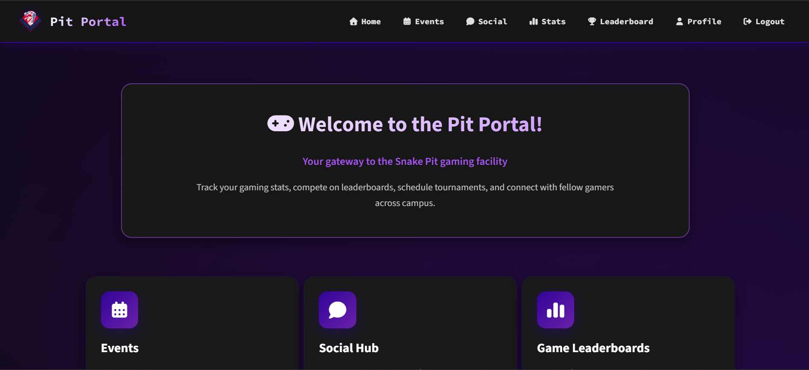
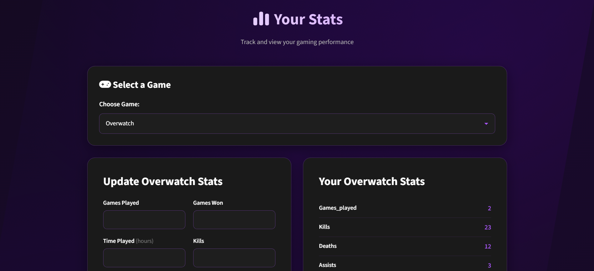
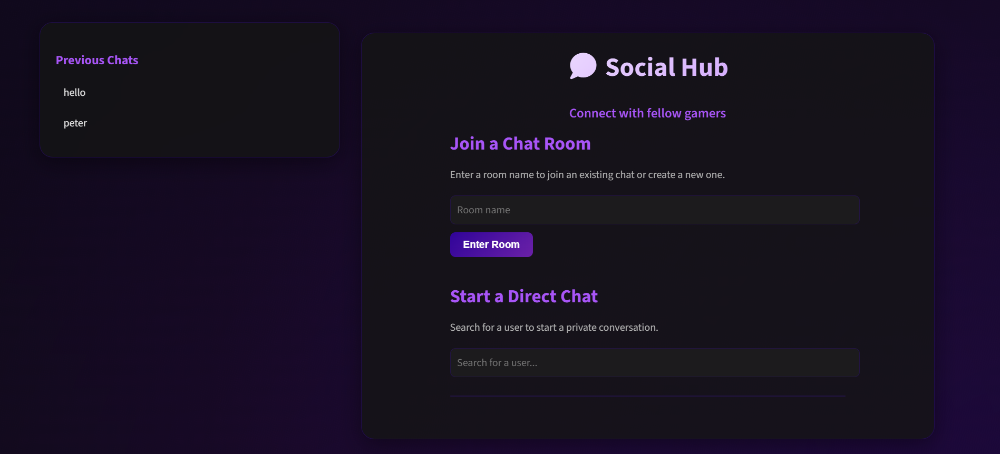
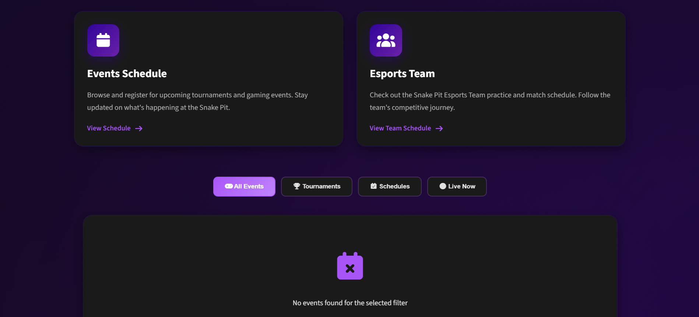

# Pit Portal

A comprehensive web portal for the Florida Southern Pit Portal, built with Django. This application provides a platform for real-time social interactions, Esports statistics, event coordination, and more.

## Features

- **User Management**: Custom user authentication and account handling
- **Real-Time Social Chat**: WebSocket-based chat rooms for community interaction
- **Game Statistics**: Detailed player and game statistics with leaderboards
- **Event Management**: Tools for organizing and tracking athletic events
- **Responsive Design**: Modern UI built with Tailwind CSS
- **Real-Time Communication**: Powered by Django Channels and Redis

## Screenshots

- **Pit Portal Home Page**

- **Pit Portal Stats Page**

- **Pit Portal Social Page**

- **Pit Portal Events Page**


## Branches

This repository has multiple branches for different deployment scenarios:

- **main-local (local development)**: Optimized for local installation and running with SQLite database and in-memory channel layers for WebSockets.
- **main**: Configured for deployment on Fly.io with PostgreSQL database and Redis for channel layers.

For local development, stay on this branch. For production deployment, switch to the Fly.io branch.

## Tech Stack

- **Backend**: Django 5.2.5, Django Channels, Daphne (ASGI server)
- **Database**: SQLite (development), PostgreSQL (production), Redis (for channel layers)
- **Frontend**: HTML, Custom CSS (Tailwind CSS configured but not actively used for styling)
- **Real-Time**: WebSockets via Django Channels
- **Deployment**: Docker, Fly.io

## Prerequisites

- Python 3.8+
- Docker (for Redis)
- Git

## Installation

### Option 1: With Docker and Redis (Recommended for Full Features)

1. **Clone the repository**:
   ```bash
   git clone <repository-url>
   cd pit_portal
   ```

2. **Set up Docker and Redis**:
   - Install Docker Desktop.
   - Run Redis in Docker: `docker run -d -p 6379:6379 redis:alpine`
   - Set environment variable: `REDIS_URL=redis://localhost:6379`

3. **Set up the environment**:
   Create a virtual environment and activate it:
   - **Windows**:
     ```bash
     python -m venv .venv
     .venv\Scripts\activate
     ```
   - **macOS/Linux**:
     ```bash
     python -m venv .venv
     source .venv/bin/activate
     ```
   - Install Python dependencies: `pip install -r requirements.txt`

4. **Run migrations**:
   ```bash
   python manage.py migrate
   ```

5. **Create a superuser** (optional):
   ```bash
   python manage.py createsuperuser
   ```

### Option 2: Simple Local Setup with In-Memory Channel Layers

1. **Clone the repository**:
   ```bash
   git clone <repository-url>
   cd pit_portal
   ```

2. **Set up the environment**:
   Create a virtual environment and activate it:
   - **Windows**:
     ```bash
     python -m venv .venv
     .venv\Scripts\activate
     ```
   - **macOS/Linux**:
     ```bash
     python -m venv .venv
     source .venv/bin/activate
     ```
   - Install Python dependencies: `pip install -r requirements.txt`

3. **Modify settings for in-memory channels**:
   In `pit_portal/settings.py`, comment out the Redis CHANNEL_LAYERS and uncomment the InMemory one.

4. **Run migrations**:
   ```bash
   python manage.py migrate
   ```

5. **Create a superuser** (optional):
   ```bash
   python manage.py createsuperuser
   ```

## Running the Application

1. **Start the development server**:
   ```bash
   daphne pit_portal.asgi:application 
   ```

2. **Access the application**:
   Open your browser and go to `http://127.0.0.1:8000`

## Development

- **Static files**: The project uses CSS. 

- **Database**: Uses SQLite by default. For production, configure PostgreSQL or another database in `settings.py`.

## Deployment

The application is configured for deployment locally 

## Project Structure

- `accounts/`: User authentication and management
- `pages/`: Static pages and home
- `social/`: Real-time chat functionality
- `stats/`:  Statistics and leaderboards
- `events/`: Event management
- `theme/`: Tailwind CSS configuration and static files

## Contributing

1. Fork the repository
2. Create a feature branch
3. Make your changes
4. Submit a pull request

## Support

For questions or issues, please open an issue on the GitHub repository.